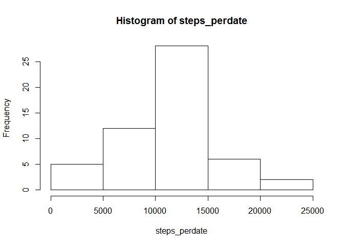

# Reproducible Research: Peer Assessment 1


## Loading and preprocessing the data

```r
unzip("activity.zip")
activity <- read.csv("activity.csv", header=TRUE, sep=",")
summary(activity)
```

```
##      steps                date          interval     
##  Min.   :  0.00   2012-10-01:  288   Min.   :   0.0  
##  1st Qu.:  0.00   2012-10-02:  288   1st Qu.: 588.8  
##  Median :  0.00   2012-10-03:  288   Median :1177.5  
##  Mean   : 37.38   2012-10-04:  288   Mean   :1177.5  
##  3rd Qu.: 12.00   2012-10-05:  288   3rd Qu.:1766.2  
##  Max.   :806.00   2012-10-06:  288   Max.   :2355.0  
##  NA's   :2304     (Other)   :15840
```


## What is mean total number of steps taken per day?  
1. Make a histogram of the total number of steps taken each day

```r
steps.perdate <- aggregate(steps ~ date, data=activity, FUN=sum, na.rm=TRUE)
hist(steps.perdate$steps, xlab="Steps per day", ylim=c(0,30),
     main="Histogram of total steps per day")
```

 
  
2. Calculate and report the mean and median of the total number of steps taken per day

```r
mean(steps.perdate$steps)
```

```
## [1] 10766.19
```

```r
median(steps.perdate$steps)
```

```
## [1] 10765
```


## What is the average daily activity pattern?  
1. Make a time series plot (i.e. type = "l") of the 5-minute interval (x-axis) and the average number of steps taken, averaged across all days (y-axis)

```r
steps.interval <- aggregate(steps ~ interval, data = activity, FUN=mean, na.rm=TRUE)
plot(steps ~ interval, data=steps.interval, type="l", 
     xlab="Interval in 5 mins", ylab="Average steps")
```

 

2. Which 5-minute interval, on average across all the days in the dataset, contains the maximum number of steps?

```r
max.step <- max(steps.interval$steps)
steps.interval[which(steps.interval$steps==max.step), ]
```

```
##     interval    steps
## 104      835 206.1698
```

## Imputing missing values  
1. Calculate and report the total number of missing values in the dataset (i.e. the total number of rows with NAs)

```r
sum(is.na(activity$steps))
```

```
## [1] 2304
```

2. Devise a strategy for filling in all of the missing values in the dataset. The strategy does not need to be sophisticated. For example, you could use the mean/median for that day, or the mean for that 5-minute interval, etc.  
**Solution: use the mean for that 5-minute interval to replace missing value**

```r
merge.data <- merge(activity, steps.interval, by="interval", suffixes=c("",".interval"))
merge.data$steps <- ifelse(is.na(merge.data$steps), merge.data$steps.interval, merge.data$steps)
summary(merge.data)
```

```
##     interval          steps                date       steps.interval   
##  Min.   :   0.0   Min.   :  0.00   2012-10-01:  288   Min.   :  0.000  
##  1st Qu.: 588.8   1st Qu.:  0.00   2012-10-02:  288   1st Qu.:  2.486  
##  Median :1177.5   Median :  0.00   2012-10-03:  288   Median : 34.113  
##  Mean   :1177.5   Mean   : 37.38   2012-10-04:  288   Mean   : 37.383  
##  3rd Qu.:1766.2   3rd Qu.: 27.00   2012-10-05:  288   3rd Qu.: 52.835  
##  Max.   :2355.0   Max.   :806.00   2012-10-06:  288   Max.   :206.170  
##                                    (Other)   :15840
```

3. Create a new dataset that is equal to the original dataset but with the missing data filled in.

```r
activity <- merge.data[, c(2,3,1)]
summary(activity)
```

```
##      steps                date          interval     
##  Min.   :  0.00   2012-10-01:  288   Min.   :   0.0  
##  1st Qu.:  0.00   2012-10-02:  288   1st Qu.: 588.8  
##  Median :  0.00   2012-10-03:  288   Median :1177.5  
##  Mean   : 37.38   2012-10-04:  288   Mean   :1177.5  
##  3rd Qu.: 27.00   2012-10-05:  288   3rd Qu.:1766.2  
##  Max.   :806.00   2012-10-06:  288   Max.   :2355.0  
##                   (Other)   :15840
```

4. Make a histogram of the total number of steps taken each day and Calculate and report the mean and median total number of steps taken per day. Do these values differ from the estimates from the first part of the assignment? What is the impact of imputing missing data on the estimates of the total daily number of steps?

```r
steps.eachday <- aggregate(steps ~ date, data=activity, FUN=sum)
hist(steps.eachday$steps, xlab="Steps each day", ylim=c(0,40),
     main="Histogram of total steps each day")
```

 

```r
mean(steps.eachday$steps)
```

```
## [1] 10766.19
```

```r
median(steps.eachday$steps)
```

```
## [1] 10766.19
```
**The mean value is the same as the estimate from the first part because we replace NA with mean value of 5-minute intervel.  
The median value is a little different because more values instead of NAs are included.**

## Are there differences in activity patterns between weekdays and weekends?  
1. Create a new factor variable in the dataset with two levels – “weekday” and “weekend” indicating whether a given date is a weekday or weekend day.


2. Devise a strategy for filling in all of the missing values in the dataset. The strategy does not need to be sophisticated. For example, you could use the mean/median for that day, or the mean for that 5-minute interval, etc.


